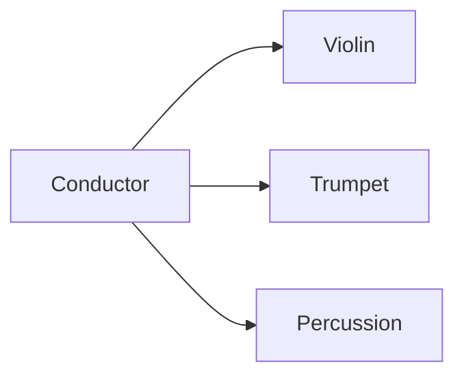
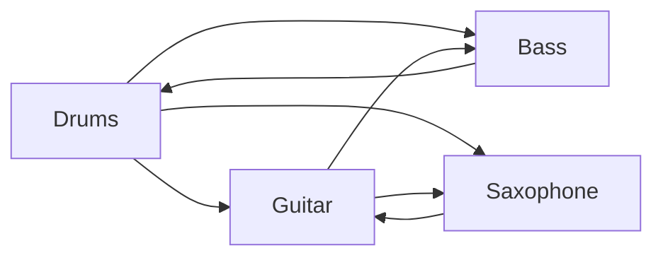

[SOLID](https://en.wikipedia.org/wiki/SOLID) is not a useful mnemonic acronym.

Even if you can remember what all the letters mean, it often just leads to more
questions. Let's take the "L", for instance: the Liskov Substitution Principle.
There's a [post on
StackOverflow](https://stackoverflow.com/questions/56860/what-is-an-example-of-the-liskov-substitution-principle)
simply titled "What is an example of the Liskov Substitution Principle?" with
over half a million views. Unless you're a math major or a computer science
historian, that name isn't going to ring any bells.

Let's stop beating ourselves up for Googling "examples of solid" every year and
collectively accept the problem: SOLID is a broken acronym.

So how do we fix it?

In my experience, the most effective way to remember and recall design
principles like SOLID is through examples and analogies.

In this blog post, I rename the letters in SOLID to remind us of a real-world
analogy of each principle. In this version of SOLID, each word evokes some
mental imagery that captures the underlying design principle without technical
jargon or math formulas. I tried to pick concepts that are familiar in our
everyday life.

What do you think?

## Surgeon

Your classes should be specialized like a surgeon.

Surgeons specialize in one specific task and do it well. Brain surgeons only do
brain surgery. Heart surgeons only do heart surgery. Their job is specific and
focused. This freedom from distractions allows them to get exceptionally good at
what they do.

If your class has too much responsibility, it won't be able to specialize in any
one task.

If your class is starting to seem scattered, consider breaking the class into
multiple more specialized classes.

(Note: if it's easier for you, you can remember this one as just "Specialist" to the same effect)

## Orchestra

Your class should extend its behavior through a common interface. An orchestra
shouldn't have to replace its conductor whenever it adds or removes a member.

To understand this principle, let's contrast orchestras with jazz bands.

Orchestras are extensible systems. Members can come and go without stopping the
show. Want to hold auditions to add new members? You don't need the whole
orchestra for a try-out; just give them some sheet music and see how they do.
Perhaps on a given night a few violin players are added. No problem. Maybe Tommy
the Trumpet Player calls in sick due to chapped lips. No one cares. The show can
still go on. This flexibility allows orchestras to scale to hundreds of members
without issue.

The same isn't true for jazz bands. While orchestras can scale to hundreds of
members, jazz bands can't scale past a handful without descending into chaos.

Why are orchestras extensible whereas jazz bands are static? Orchestras
have a conductor.

In an orchestra, the conductor provides a common interface. The
conductor stands on a podium in clear sight of all the members to send them
visual cues. Each member uses these cues, along with their sheet music, to play
their part. This creates an auditory illusion of coordination among the members
of the orchestra. I call it an illusion because the members aren't even
listening to each other, let alone doing any coordination; they're just focusing
on their own part while watching the conductor for cues.

Jazz bands, on the other hand, don't rely on a central interface. Instead, they
coordinate through their chemistry as a band. For a jazz band to work, the
members need to know each other well. Adding a new member to the band requires
hours of try-outs to see if they're a good "fit". It's a complicated process.
You can't just swap out, add, or remove members of a jazz band like you can with
an orchestra.

Take a look at how your classes extend functionality. What would it take to add
new functionality to your class? If it requires modifying the class itself, its
a violation of this principle. Remember, an orchestra shouldn't need to replace its
conductor every time it adds a new member.

## LEGOs

In your LEGO kit, any block can be replaced by another block with a compatible
connector.

This doesn't mean both blocks must have the _same_ connectors. They just need to
be _compatible_ connectors.

If some blocks have V1 connectors and others have V2, they will still connect if
V2 is backwards compatible with V1. But if V3 connectors implement a new,
non-comforming standard, you should not try to replace a V2 block with a V3
block.

If you have multiple classes implementing the same interface, lookout for cases
where a class appears categorically different from others. When you notice this,
move those classes into a new interface.

## Insurance Policy

Like an insurance policy, your interfaces should be minimal.

Imagine if an insurance company only offered one policy. You either get full
coverage or nothing. This means someone who only wants liability
coverage will have to also pay for medical and collision coverage as well.

In reality, insurance companies tend to create flexible plans to stay
competitive. This enables their customers to only pay for the coverage they want
and nothing more.

When implementing your interfaces, do you often find yourself leaving many
methods unimplemented? Or perhaps you find yourself forced to implement methods
you won't actually use? If so, break your interfaces into smaller ones and join
them together through inheritance as needed.

## Designer

Like a designer, your high-level classes should focus on the big picture,
not implementation details.

Imagine an architect that goes to the construction site and micromanages the
builders. The architect tells them what nails to use, where every pipe should
go, and where every wire of electricity should run. As the project goes on, the
architect becomes overwhelmed and the building quality declines. It's difficult
to keep high-level design in mind while dealing with the low-level details.

Instead, the architect can create a blueprint. The blueprint is a document which
contains the architect's high-level design of the home. The builders know how to
translate the blueprint into the concrete details (no pun intended). The
blueprint allows the architect to focus on design while allowing the builders to
focus on the specifics of the building process.

In this example, If you have a class that's doing both high-level and low-level
tasks, consider breaking them into multiple classes. As a bonus, you can get
added benefits if the classes communicate through an interface (see "Orchestra"
above).

# Summary

SOLID is a broken mnemonic device. Instead of helping us recall abstract design
principles, it tends to lead to more questions. By replacing each letter of
SOLID with a familiar analogy, it helps us recall more useful information.

What do you think? Feel free to let me know!
